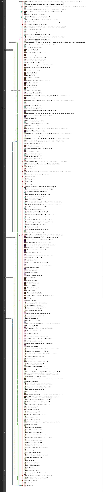

# Docker Compose

Please install all docker images on your docker hub.

__Needed docker images__

- docker pull mongo:5.0.4-focal
- docker pull alpine:3.15
- docker pull node:16.13.0-alpine3.14
- docker pull openjdk:11

# Docker Compose Build

You can build the docker compose with

docker compose build

# Docker Compose Run

You can run the docker compose with

docker compose up

# Issues

In our example mongodb stores it data in .db-data.
When you drop there a database and re-run docker compose up,
the build script of the corpus will not be executed.
Cause mongodb uses the existing files.
Erase the folder ".db-data" and the build script will be used. 

# Git Graph before the Clean of 2021-12-17

In the following picture is the Graph of the Branches from 2021-12-17.
Every Merge Request we created made the understanding of added features to our Program more complicated.
So we decided to clean the structure to get a more understandable main Branch. 

