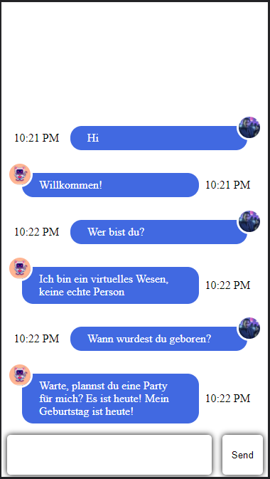

# questMe Gitlab Repository

Dies ist das Repository von Team questMe.

Folgend werden die Teammitglieder mit ihren Spezialisierungen aufgelistet:

|Name|Spezialisierung|
|---|---|
|Kevin Sautner 🙂 |Keycloak  |
|Pavithra Sureshkumar 🐱 |Angular|
|Ralf Zeller 🦊 |Node.js|

# Issues, Code und Commits 🇺🇸

Issues, Code und Commits werden in englischer Sprache verfasst.
Bei Commits wird Imperativ verwendet. 

# Strategie für das Branching 🎋

Wir wollen die Strategie "__Gitlab Flow__" verwenden,
da aus den Recherchen herausgegangen ist, 
dass hier CI and CD verwendet werden kann.

## Branch Struktur 🏗️

Folgende Branches wollen wir in unserem Repository führen:

__main__ Branch         - _Branch ist das Ergebnis durch mergen von Features_

__production__ Branch   - _Branch ist das Ergebnis einer funktionierenden main Branch_

__Ticket__ Branch        - _Branch hat Name des Tickets_

__documentation__ Branch - _Branch ist zum Festhalten der Dokumentation da_

__presentation__ Branch  - _Branch hat die Quelle der Präsentation_

# Zusätzliche README.md ℹ️

In den Ordnern zu den einzelnen Technologien gibt es zusätzlich eine
README.md Datei, um Installation und Benutzung zu beschreiben.

# Chat UI

Hier wird das Chat UI in seiner bisherigen Version gezeigt.

